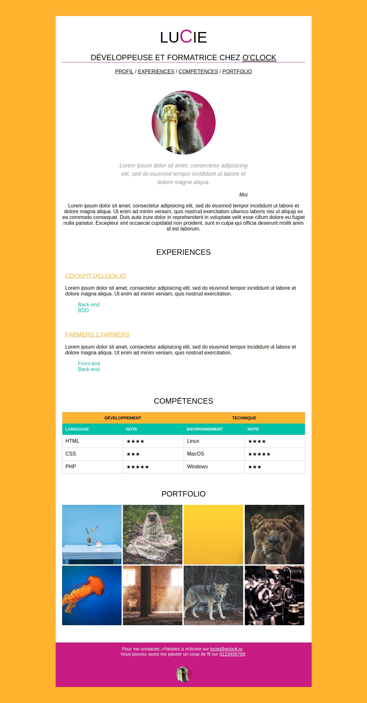

# Support Page Perso

Dans ce repo vous trouverez un exemple d'implémentation de page perso.
Comme d'habitude, libre à vous de le récupérer et de l'installer sur votre machine.

Vous pouvez observer le code pour comprendre un peu mieux le fonctionnement de CSS, ou piquer des idées!

### Notre page personnelle

# page-perso-lucie
